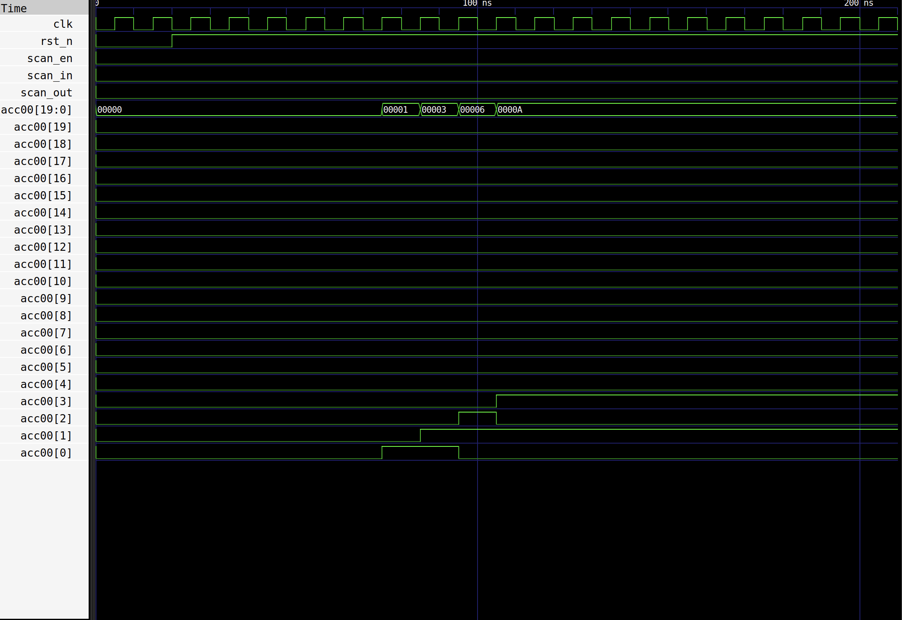
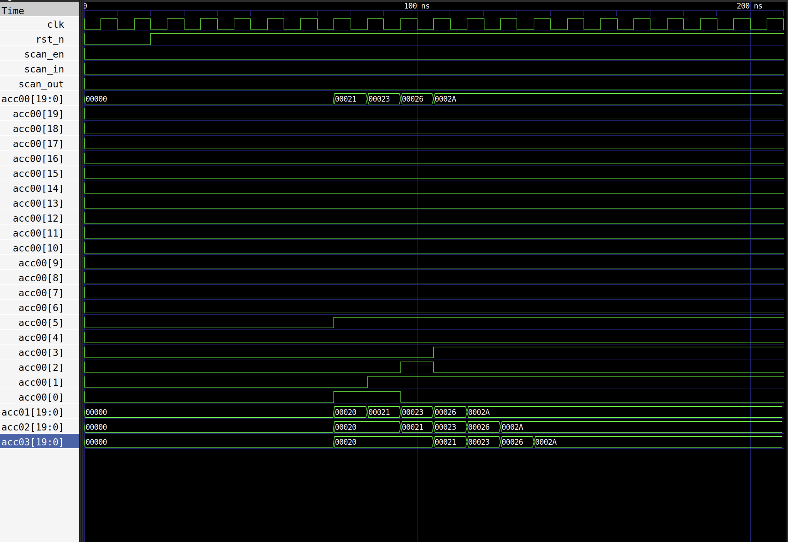

# AI Accelerator: DFT & Diagnostic Fault Analysis
**Focus:** Hardware Reliability, Scan-Chain Insertion, and Fault Observability

This project demonstrates the implementation of **Design-for-Test (DFT)** methodology within a 4x4 Systolic Array architecture. By transitioning from standard flip-flops to scan-ready cells and implementing a diagnostic testbench, I achieved 100% observability of internal hardware faults.

---

## DFT Implementation Details

* **Scan Chain Length:** 320 bits (Serialized internal registers across 16 PEs).
* **Cell Selection:** Replaced standard registers with `sky130_fd_sc_hd__sdfrtp_1` (Scan D-Flip-Flops).
* **Timing Sign-off:** Successfully closed timing with a hold-slack margin of **+1.82ns**, ensuring stable data shifting across the chain.
* **Fault Model:** Stuck-at-1 (SA1) fault injection.

---

## Fault Injection & Detection Strategy

To simulate a manufacturing defect, I modified the **Processing Element (PE)** accumulator logic:
- **The Injection:** A hardcoded Stuck-at-1 fault was placed on **Bit 5** of the 20-bit accumulator (`acc[5]`).
- **The Manifestation:** In functional simulation, this caused the accumulator to always carry a `+0x20` offset, corrupting the Matrix-Vector multiplication results.

### **Diagnostic Waveform Evidence**
The screenshot below compares the **Golden Model** (Correct) vs. the **Faulty Model**. Note how Bit 5 in the faulty run is "stuck" high, while the other bits toggle normally.

**Golden vs Faulty Waveform:**

* **Golden-Waveform:**

* **Faulty-Waveform:**

---

## Diagnostic Methodology

1.  **Capture Phase:** The `scan_enable` signal is de-asserted for one clock cycle, allowing the PEs to capture their faulty internal state into the scan-flops.
2.  **Shift Phase:** `scan_enable` is asserted, and the captured 320-bit state is shifted out through the `scan_out` pin.
3.  **Detection:** By comparing the serial output stream against the expected test vector, the exact location of the Bit-5 failure was identified without requiring physical probing of the internal gates.

---

## Project Contents
* `hdl/`: DFT-ready Verilog including the `smart_pe_faulty.v` module.
* `tb/`: Specialized Scan-Chain testbench for fault diagnosis.
* `assets/reports/`: Hold-timing analysis and DFT cell statistics.
* `assets/visuals/`: GDSII layouts showing the physical placement of scan-flops.
